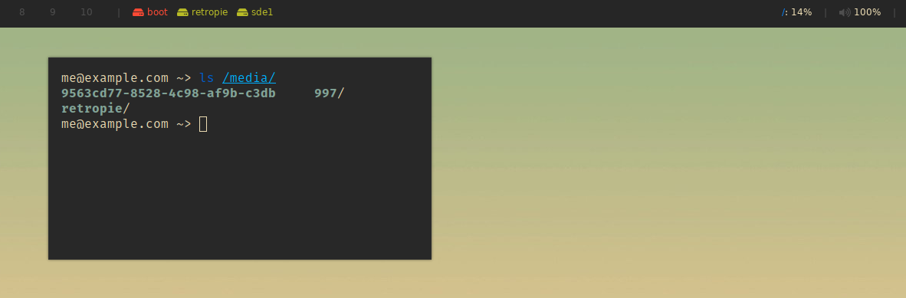

# polybar-removable-disks

Polybar script for displaying and mounting/unmounting removable disks.

Left-click a partition to mount it, right-click to unmount. Supports drives with multiple partitions and each partition can be mounted individually. Will display partition's label if present, otherwise the name of the partition itself.

Honors theme colors in ~/.Xresources; Unmounted partitions will show as "red" and mounted as "green" (the resolved colors will be theme-dependent).



Add the following to your polybar config:

```
[module/removable-disks]
type = custom/script
exec = ~/.config/polybar/scripts/removable_disks.sh
```

## Dependencies

* `jq`
* `udisks2`
* `xrdb`
